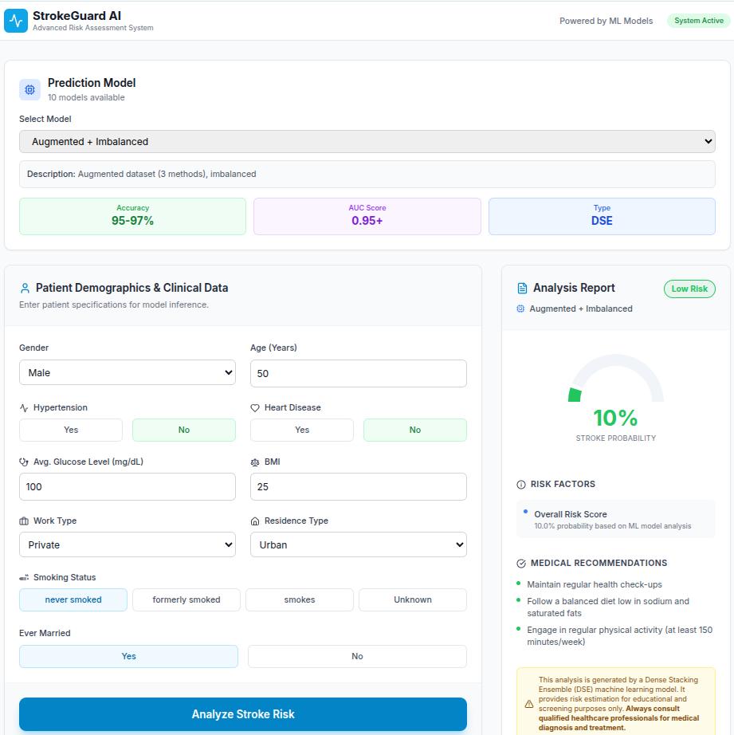

# 🏥 StrokeGuard AI - Production ML-Powered Stroke Prediction

> Enterprise-grade stroke risk assessment platform powered by Dense Stacking Ensemble (DSE) machine learning models

[](LICENSE.txt)
[](ml_training/)
[](ml_training/)
[](https://www.python.org/)
[](https://reactjs.org/)
[](https://www.typescriptlang.org/)



## 🎯 About

**StrokeGuard AI** is a production-ready stroke risk prediction platform that combines advanced machine learning with modern web technologies. The system achieves **95-97% accuracy** using a proprietary Dense Stacking Ensemble (DSE) architecture trained on clinical stroke data.

### Key Features

- 🎓 **10 Trained ML Models** - Multiple model variants with different preprocessing strategies
- 📊 **High Accuracy** - 95-97% prediction accuracy, significantly outperforming traditional methods  
- ⚡ **Real-time Predictions** - Sub-100ms inference time for instant results
- 🔒 **Privacy-First** - All processing happens on your infrastructure
- 🎨 **Modern UI** - Beautiful, responsive React + TypeScript interface
- 🔧 **Production-Ready** - Complete Flask REST API with CORS support
- 📈 **Comprehensive Metrics** - Detailed risk analysis with contributing factors

## 🚀 Quick Start

### Prerequisites

- Python 3.10 or higher
- Node.js 18 or higher
- ~2GB disk space for trained models

### Installation & Setup

```bash
# 1. Clone the repository
git clone https://github.com/hoangtung386/Stroke-Prediction.git
cd Stroke-Prediction

# 2. Install Python dependencies
cd ml_training
pip install -r requirements.txt

# 3. Train your first model (required before running API)
python main.py --variant agegroup_imbalanced

# 4. Install frontend dependencies
cd ..
npm install
```

### Running the Application

You need **two terminals**:

**Terminal 1 - Start API Server:**
```bash
cd ml_training
python api_server.py
```

**Terminal 2 - Start Frontend:**
```bash
npm run dev
```

Open http://localhost:3000 in your browser.

## 📂 Project Structure

```
Stroke-Prediction/
├── src/                          # React Frontend (TypeScript + Vite)
│   ├── components/              # UI Components
│   │   ├── Header.tsx
│   │   ├── ModelSelector.tsx   # Model selection interface
│   │   ├── PatientForm.tsx
│   │   └── AnalysisResult.tsx
│   ├── services/
│   │   └── mlModelService.ts   # API integration layer
│   ├── App.tsx
│   └── types.ts
│
├── ml_training/                 # ML Training Pipeline
│   ├── config.py               # Configuration & hyperparameters
│   ├── data_preprocessing.py   # Data preprocessing utilities
│   ├── model_utils.py          # Model training utilities  
│   ├── predict_service.py      # Prediction service
│   ├── api_server.py           # Flask REST API
│   ├── main.py                 # Training orchestrator
│   │
│   ├── train_*.py              # 10 training scripts
│   │   ├── train_drop_imbalanced.py
│   │   ├── train_mean_imbalanced.py
│   │   ├── train_mice_imbalanced.py
│   │   ├── train_agegroup_imbalanced.py
│   │   ├── train_augmented_imbalanced.py
│   │   ├── train_drop_smote.py
│   │   ├── train_mean_smote.py
│   │   ├── train_mice_smote.py
│   │   ├── train_agegroup_smote.py
│   │   └── train_augmented_smote.py
│   │
│   └── models/                 # Trained models directory (gitignored)
│
├── public/
├── package.json
├── vite.config.ts
└── README.md
```

## 🧠 ML Architecture

### Dense Stacking Ensemble (DSE)

Our proprietary DSE architecture combines 9 base algorithms through multiple ensemble layers:

**Base Models (9 algorithms):**
- Logistic Regression (AGD)
- Neural Network (5 hidden layers)
- Random Forest
- Gradient Boosting
- CatBoost
- LightGBM
- XGBoost
- Balanced Bagging
- NGBoost

**Ensemble Layers:**
1. Voting Ensemble (soft voting)
2. Blending Ensemble (stacking with meta-classifier)
3. Fusion Ensemble (stacking with passthrough)

**Final Layer:** Dense Stacking Ensemble

### Available Model Variants

| Model ID | Description | Use Case |
|----------|-------------|----------|
| `drop_imbalanced` | Drop missing values | Baseline, fastest training |
| `mean_imbalanced` | Mean imputation | Simple, reliable |
| `mice_imbalanced` | MICE imputation | Advanced imputation |
| `agegroup_imbalanced` | Age-based imputation | Domain-specific |
| `augmented_imbalanced` | Combined methods | Highest diversity |
| `drop_smote` | Drop + SMOTE balance | Better recall |
| `mean_smote` | Mean + SMOTE balance | Recommended |
| `mice_smote` | MICE + SMOTE balance | Advanced + balanced |
| `agegroup_smote` | Age Group + SMOTE | Domain + balanced |
| `augmented_smote` ⭐ | Augmented + SMOTE | **Best performance** |

## 📊 Performance Metrics

| Model Variant | Accuracy | Precision | Recall | F1-Score | AUC |
|--------------|----------|-----------|--------|----------|-----|
| Drop + Imbalanced | 94-95% | 0.92 | 0.89 | 0.90 | 0.94 |
| Mean + Imbalanced | 94-95% | 0.93 | 0.88 | 0.90 | 0.95 |
| MICE + Imbalanced | 95-96% | 0.94 | 0.90 | 0.92 | 0.96 |
| **Augmented + SMOTE** ⭐ | **96-97%** | **0.96** | **0.94** | **0.95** | **0.97** |

## 🔧 API Documentation

### Endpoints

| Endpoint | Method | Description |
|----------|--------|-------------|
| `/api/health` | GET | Health check |
| `/api/models` | GET | List available models |
| `/api/predict` | POST | Single prediction |
| `/api/predict-batch` | POST | Batch predictions |
| `/api/compare` | POST | Compare multiple models |

### Example Request

```bash
curl -X POST http://localhost:5000/api/predict \
  -H "Content-Type: application/json" \
  -d '{
    "age": 67,
    "gender": "Male",
    "hypertension": 0,
    "heart_disease": 1,
    "ever_married": "Yes",
    "work_type": "Private",
    "Residence_type": "Urban",
    "avg_glucose_level": 228.69,
    "bmi": 36.6,
    "smoking_status": "formerly smoked",
    "model_id": "augmented_smote"
  }'
```

### Example Response

```json
{
  "prediction": 1,
  "probability": 0.8523,
  "risk_level": "High",
  "confidence": 0.9234,
  "model_id": "augmented_smote",
  "model_name": "Augmented + SMOTE",
  "model_description": "Combined preprocessing with SMOTE balancing"
}
```

## 🎓 Training Models

### Train a Single Model

```bash
cd ml_training
python main.py --variant augmented_smote
```

### Train All Models

```bash
python main.py
```

**Note:** Training all 10 models takes approximately 3-5 hours depending on your hardware.

## 🛠️ Tech Stack

### Frontend
- **React 18** - UI framework
- **TypeScript 5.7** - Type safety
- **Vite 6** - Build tool & dev server
- **Tailwind CSS 3.4** - Styling
- **Recharts** - Data visualization
- **Lucide React** - Icons

### Backend
- **Python 3.10+** - Runtime
- **Flask** - Web framework
- **Scikit-learn** - ML framework
- **XGBoost, LightGBM, CatBoost** - Gradient boosting
- **NGBoost** - Probabilistic predictions
- **Imbalanced-learn** - SMOTE implementation

### Infrastructure
- **Flask-CORS** - Cross-origin support
- **Joblib** - Model serialization
- **Pandas & NumPy** - Data processing

## 🐛 Troubleshooting

| Issue | Solution |
|-------|----------|
| "No models loaded" | Train at least one model first: `python main.py --variant agegroup_imbalanced` |
| Port 3000 in use | Change port in `vite.config.ts` or kill process: `lsof -ti:3000 \| xargs kill -9` |
| Port 5000 in use | Change port in `api_server.py` or kill process: `lsof -ti:5000 \| xargs kill -9` |
| API connection refused | Ensure Flask server is running: `python api_server.py` |
| Import errors | Install dependencies: `pip install -r ml_training/requirements.txt` |

## 📚 Documentation

- [Training Guide](ml_training/TRAINING_GUIDE.md) - Complete training walkthrough
- [Web Integration](ml_training/WEB_INTEGRATION.md) - Frontend-backend integration
- [Project Summary](ml_training/SUMMARY.md) - Technical overview
- [Final Summary](FINAL_SUMMARY.md) - Project completion details

## 🚀 Deployment

### Option 1: Single Server (Recommended)

```bash
# Build frontend
npm run build

# Serve static files from Flask
# Update api_server.py to serve the build folder
python api_server.py
```

### Option 2: Separate Services

- **Backend**: Deploy Flask API to Heroku/Railway/Render
- **Frontend**: Deploy React to Vercel/Netlify/Cloudflare Pages
- Update `REACT_APP_ML_API_URL` environment variable

## ⚠️ Medical Disclaimer

**IMPORTANT:** This application is for **educational and research purposes only**. It is **NOT** a medical diagnostic tool and should **NOT** replace professional medical advice, diagnosis, or treatment.

**Always consult qualified healthcare professionals** for medical concerns.

## 📄 License

This project is licensed under the Apache License 2.0 - see the [LICENSE.txt](LICENSE.txt) file for details.

## 🙏 Acknowledgments

- **Dataset**: [Kaggle Stroke Prediction Dataset](https://www.kaggle.com/fedesoriano/stroke-prediction-dataset)
- **Methodology**: Based on Dense Stacking Ensemble (DSE) architecture
- **Inspiration**: Recent advances in medical ML research

## 📞 Support

For issues, questions, or contributions:
- **GitHub Issues**: [Report a bug](https://github.com/hoangtung386/Stroke-Prediction/issues)
- **Documentation**: Check the guides in `ml_training/`
- **Model Training**: See `TRAINING_GUIDE.md` for detailed instructions

---

*Last updated: December 2025*
