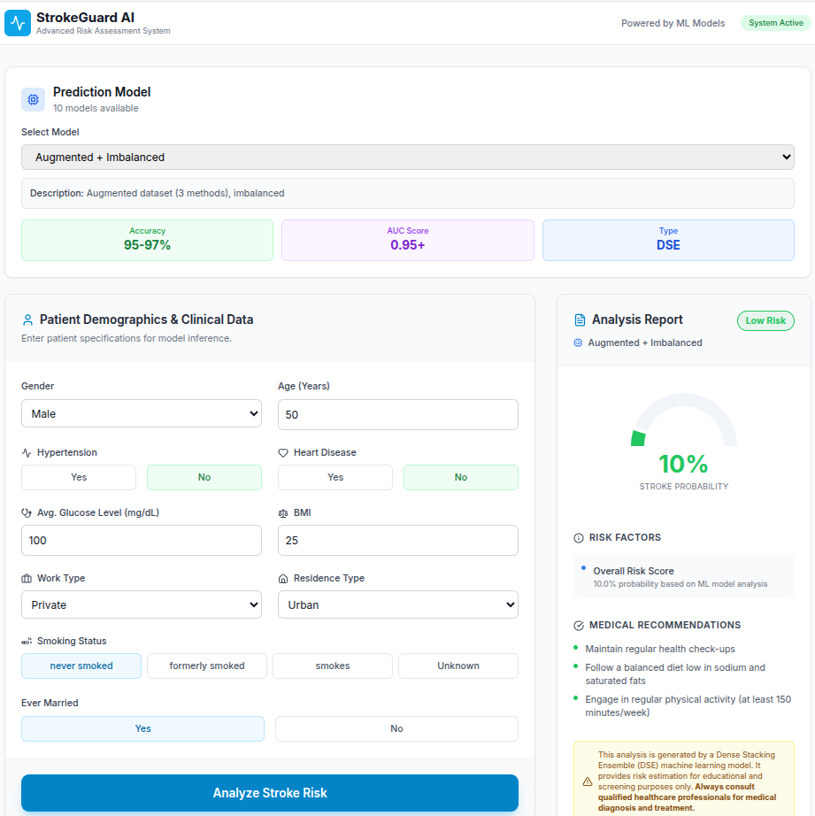

# StrokeGuard AI - ML-Powered Stroke Prediction

> Stroke risk assessment platform powered by Dense Stacking Ensemble (DSE) machine learning models

[](LICENSE.txt)
[](backend/)
[](backend/)
[](https://www.python.org/)
[](https://reactjs.org/)
[](https://www.typescriptlang.org/)



## About

**StrokeGuard AI** is a stroke risk prediction platform that combines advanced machine learning with modern web technologies. The system achieves **95-97% accuracy** using a Dense Stacking Ensemble (DSE) architecture trained on clinical stroke data.

### Key Features

- **10 Trained ML Models** - Multiple model variants with different preprocessing strategies
- **High Accuracy** - 95-97% prediction accuracy
- **Real-time Predictions** - Sub-100ms inference time
- **Modern UI** - Responsive React + TypeScript interface
- **REST API** - Complete Flask API with CORS support

## Project Structure

```
Stroke-Prediction/
├── frontend/                     # React Frontend (TypeScript + Vite)
│   ├── src/
│   │   ├── components/          # UI Components
│   │   │   ├── Header.tsx
│   │   │   ├── ModelSelector.tsx
│   │   │   ├── PatientForm.tsx
│   │   │   └── AnalysisResult.tsx
│   │   ├── types/               # TypeScript type definitions
│   │   │   ├── patient.ts
│   │   │   └── prediction.ts
│   │   ├── constants/           # Form options, etc.
│   │   ├── services/            # API integration layer
│   │   │   └── mlModelService.ts
│   │   └── App.tsx
│   ├── package.json
│   └── vite.config.ts
│
├── backend/                      # Python ML Backend
│   ├── config.py                # Configuration & hyperparameters
│   ├── data_preprocessing.py    # Data preprocessing utilities
│   ├── model_utils.py           # Model training utilities
│   ├── training/
│   │   └── train.py             # Unified training script (all 10 variants)
│   ├── api/
│   │   ├── server.py            # Flask REST API
│   │   └── predict_service.py   # Prediction service
│   ├── tests/                   # Unit tests
│   ├── scripts/                 # Quick start scripts
│   ├── pyproject.toml           # Project config (uv / pip)
│   └── requirements.txt
│
├── docs/                         # Documentation
│   ├── TRAINING_GUIDE.md
│   ├── WEB_INTEGRATION.md
│   └── SUMMARY.md
│
├── .gitignore
├── README.md
└── LICENSE.txt
```

## Quick Start

### Prerequisites

- Python 3.10 or higher
- Node.js 18 or higher
- ~2GB disk space for trained models

### Option A: Setup with uv (recommended)

[uv](https://docs.astral.sh/uv/) is a fast Python package manager that handles virtual environments automatically.

```bash
# 1. Clone the repository
git clone https://github.com/hoangtung386/Stroke-Prediction.git
cd Stroke-Prediction

# 2. Install backend dependencies (auto-creates .venv)
cd backend
uv sync

# 3. Train your first model
uv run python -m training.train --imputation agegroup --balancing imbalanced

# 4. Install frontend dependencies
cd ../frontend
npm install
```

**Running with uv:**

```bash
# Terminal 1 - API Server
cd backend
uv run python -m api.server

# Terminal 2 - Frontend
cd frontend
npm run dev
```

### Option B: Setup with pip

```bash
# 1. Clone the repository
git clone https://github.com/hoangtung386/Stroke-Prediction.git
cd Stroke-Prediction

# 2. Create virtual environment and install dependencies
cd backend
python -m venv .venv
source .venv/bin/activate   # Linux/macOS
# .venv\Scripts\activate    # Windows
pip install -r requirements.txt

# 3. Train your first model
python -m training.train --imputation agegroup --balancing imbalanced

# 4. Install frontend dependencies
cd ../frontend
npm install
```

**Running with pip:**

```bash
# Terminal 1 - API Server
cd backend
source .venv/bin/activate
python -m api.server

# Terminal 2 - Frontend
cd frontend
npm run dev
```

Open http://localhost:3000 in your browser.

## ML Architecture

### Dense Stacking Ensemble (DSE)

The DSE architecture combines 8 base algorithms through multiple ensemble layers:

**Base Models:**
- Logistic Regression (AGD)
- Neural Network (5 hidden layers)
- Random Forest
- Gradient Boosting
- CatBoost
- LightGBM
- XGBoost
- Balanced Bagging

**Ensemble Layers:**
1. Voting Ensemble (soft voting)
2. Blending Ensemble (stacking with meta-classifier)
3. Fusion Ensemble (stacking with passthrough)
4. Final Dense Stacking Ensemble

### Available Model Variants

| Model ID | Description | Use Case |
|----------|-------------|----------|
| `drop_imbalanced` | Drop missing values | Baseline, fastest training |
| `mean_imbalanced` | Mean imputation | Simple, reliable |
| `mice_imbalanced` | MICE imputation | Advanced imputation |
| `agegroup_imbalanced` | Age-based imputation | Domain-specific |
| `augmented_imbalanced` | Combined methods | Highest diversity |
| `drop_smote` | Drop + SMOTE balance | Better recall |
| `mean_smote` | Mean + SMOTE balance | Recommended |
| `mice_smote` | MICE + SMOTE balance | Advanced + balanced |
| `agegroup_smote` | Age Group + SMOTE | Domain + balanced |
| `augmented_smote` | Augmented + SMOTE | **Best performance** |

## Training Models

### Train a Single Model

```bash
cd backend

# With uv
uv run python -m training.train --imputation augmented --balancing smote

# With pip (venv activated)
python -m training.train --imputation augmented --balancing smote
```

### Train All Models

```bash
cd backend
uv run python -m training.train --all
# or: python -m training.train --all
```

**Note:** Training all 10 models takes approximately 3-5 hours depending on hardware.

## API Documentation

### Endpoints

| Endpoint | Method | Description |
|----------|--------|-------------|
| `/api/health` | GET | Health check |
| `/api/models` | GET | List available models |
| `/api/predict` | POST | Single prediction |
| `/api/predict-batch` | POST | Batch predictions |
| `/api/compare` | POST | Compare multiple models |

### Example Request

```bash
curl -X POST http://localhost:5000/api/predict \
  -H "Content-Type: application/json" \
  -d '{
    "age": 67,
    "gender": "Male",
    "hypertension": 0,
    "heart_disease": 1,
    "ever_married": "Yes",
    "work_type": "Private",
    "Residence_type": "Urban",
    "avg_glucose_level": 228.69,
    "bmi": 36.6,
    "smoking_status": "formerly smoked",
    "model_id": "augmented_smote"
  }'
```

### Example Response

```json
{
  "prediction": 1,
  "probability": 0.8523,
  "risk_level": "High",
  "confidence": 0.9234,
  "model_id": "augmented_smote",
  "model_name": "Augmented + SMOTE",
  "model_description": "Augmented dataset (3 methods), SMOTE balanced"
}
```

## Tech Stack

### Frontend
- **React 18** + **TypeScript 5.7** + **Vite 6**
- **Tailwind CSS 3.4** - Styling
- **Recharts** - Data visualization
- **Lucide React** - Icons

### Backend
- **Python 3.10+** + **Flask**
- **Scikit-learn** - ML framework
- **XGBoost, LightGBM, CatBoost** - Gradient boosting
- **Imbalanced-learn** - SMOTE implementation
- **Joblib** - Model serialization

## Troubleshooting

| Issue | Solution |
|-------|----------|
| "No models loaded" | Train at least one model: `cd backend && uv run python -m training.train --imputation agegroup --balancing imbalanced` |
| Port 3000 in use | Change port in `frontend/vite.config.ts` |
| Port 5000 in use | Set `PORT` env var: `PORT=5001 python -m api.server` |
| API connection refused | Ensure Flask server is running |
| Import errors | Install dependencies: `cd backend && uv sync` or `pip install -r requirements.txt` |

## Documentation

- [Training Guide](docs/TRAINING_GUIDE.md) - Complete training walkthrough
- [Web Integration](docs/WEB_INTEGRATION.md) - Frontend-backend integration
- [Project Summary](docs/SUMMARY.md) - Technical overview

## Medical Disclaimer

**IMPORTANT:** This application is for **educational and research purposes only**. It is **NOT** a medical diagnostic tool and should **NOT** replace professional medical advice, diagnosis, or treatment.

## License

This project is licensed under the Apache License 2.0 - see the [LICENSE.txt](LICENSE.txt) file for details.

## Acknowledgments

- **Dataset**: [Kaggle Stroke Prediction Dataset](https://www.kaggle.com/fedesoriano/stroke-prediction-dataset)
- **Methodology**: Based on Dense Stacking Ensemble (DSE) architecture
